# Supabase Schema Vision: Legacy vs. Target

This document captures a visual diff between the current Supabase schema and the tables/columns required to support the new user journeys (PDF extraction, payments, commission visualization).

---

## Current Schema Snapshot


---

## Proposed Schema Extensions (Target)

```mermaid
erDiagram
    brokerages ||--o{ agents : ""
    brokerages ||--o{ transactions : ""
    agents ||--o{ transactions : ""
    transactions ||--o{ transaction_events : ""
    transactions ||--o{ commission_documents : ""
    transactions ||--o{ commission_evidences : ""
    transactions ||--o{ commission_checklists : ""
    transactions ||--o{ commission_payouts : ""
    commission_payouts }o--|| payout_batches : "belongs to"
    commission_payouts ||--o{ payout_failures : ""
    agents ||--o{ agent_metrics : ""
    transactions ||--o{ deal_stage_snapshots : ""

    commission_documents {
      uuid id PK
      uuid transaction_id FK
      text doc_type
      text storage_path
      uuid uploaded_by
      timestamptz uploaded_at
      text checksum
      text status
    }

    commission_evidences {
      uuid id PK
      uuid transaction_id FK
      uuid document_id FK
      jsonb extraction_data
      numeric confidence
      bool requires_review
      timestamptz created_at
    }

    commission_checklists {
      uuid id PK
      uuid transaction_id FK
      text item_key
      text status
      uuid validated_by
      timestamptz validated_at
      text notes
    }

    commission_payouts {
      uuid id PK
      uuid transaction_id FK
      uuid agent_id FK
      uuid batch_id FK
      numeric payout_amount
      text status
      bool auto_ach
      text ach_provider
      text ach_reference
      timestamptz scheduled_at
      timestamptz paid_at
      text failure_reason
    }

    payout_batches {
      uuid id PK
      uuid accountant_id
      timestamptz created_at
      numeric total_amount
      bool auto_ach_enabled
      text status
    }

    payout_failures {
      uuid id PK
      uuid payout_id FK
      text provider_code
      text provider_message
      timestamptz occurred_at
    }

    agent_metrics {
      uuid id PK
      uuid agent_id FK
      date period_start
      date period_end
      numeric total_gci
      numeric total_deal_volume
      integer deals_closed
      integer deals_in_pipeline
      integer average_days_to_close
      numeric performance_score
      timestamptz data_refreshed_at
    }

    deal_stage_snapshots {
      uuid id PK
      uuid transaction_id FK
      text stage
      timestamptz entered_at
      timestamptz exited_at
      bool stalled
    }
```



---

## Existing Tables → Proposed Enhancements

| Existing Table | Current Role (Today) | Proposed Enhancements | Rationale |
| -------------- | -------------------- | --------------------- | --------- |
| `brokerages` | One row per brokerage with global fees (franchise, E&O, transaction). | Add optional fields for ACH provider config (`ach_provider`, `ach_config` JSON). | Enables payouts module to know which provider and credentials to use per brokerage. |
| `agents` | Stores agent identity, activity flag, default split/cap, foreign key to brokerage. | Add `team_name`, `manager_id`, `focus_tags` JSON, and `default_bank_account_id` (FK). | Supports commission visualization filters (teams), coaching hierarchies, and payment readiness. |
| `transactions` | Canonical commission record: addresses, participants, final deal amounts, commission percentages, referrals, notes. | Add intake + verification fields (`intake_status`, `confidence_state`, `checklist_state`, `gci_verified_at`, `gci_verification_source`), payout linkage (`pending_payout_amount`, `latest_payout_id`), freshness marker (`data_freshness_at`). | Tracks progress from upload to approval, records bank verification, and connects to payouts for dashboard freshness banners. |
| `commission_evidences` | Stores structured JSON extractions per document (`extraction_data`, `confidence`, `requires_review`). | Add `extraction_method` (OCR/LLM/manual), `created_by`, and conflict metadata for overrides. | Tracks which pipeline produced a snapshot, supports reviewer accountability, and preserves low-confidence flags. |
| `transaction_events` | Audit trail of actions on a transaction with metadata (`event_type`, `actor_name`). | Add `related_extraction_id` FK, `confidence_delta`, `stage_transition` booleans. | Provides a history of overrides triggered by low confidence, and records pipeline stage moves for visualization. |

For each existing table, the idea is to keep the current data intact and append fields that let the new features work without introducing entirely new entities unless necessary.

---

## New Tables Summary

| Table | Purpose | Key Fields |
| ----- | ------- | ---------- |
| `commission_documents` | Persist uploaded deal sheet, contract, invoice, disclosure | `doc_type`, `storage_path`, `checksum`, `status` |
| `commission_evidences` | Store structured parsed payloads per document | `extraction_data`, `confidence`, `requires_review`, `document_id` |
| `commission_checklists` | Track compliance checklist items | `item_key`, `status`, `validated_by`, `validated_at` |
| `commission_payouts` | Represent each payout attempt | `payout_amount`, `status`, `auto_ach`, `ach_reference`, `failure_reason` |
| `payout_batches` | Batch together payouts scheduled in one action | `total_amount`, `auto_ach_enabled`, `status` |
| `payout_failures` | Detailed ACH failure log | `provider_code`, `provider_message`, `occurred_at` |
| `agent_metrics` | Aggregated stats per agent per period | `total_gci`, `total_deal_volume`, `deals_closed`, `performance_score` |
| `deal_stage_snapshots` | Track pipeline stages for stalled-deal visualizations | `stage`, `entered_at`, `exited_at`, `stalled` |
| `payout_bank_accounts` | Store validated ACH destinations per agent | `agent_id`, `account_nickname`, `mask`, `provider_reference`, `is_default` |

---

## Track → Table Usage Map

- **PDF Extraction (Ashley)**  
  - Reads/Writes: `transactions` (intake + confidence fields), `commission_documents`, `commission_evidences`, `commission_checklists`, `transaction_events`.  
  - Focus: uploading source docs, populating parsed fields, managing checklist completion, logging overrides.

- **Payments (Erica)**  
  - Reads/Writes: `commission_payouts`, `payout_batches`, `payout_failures`, `payout_bank_accounts`, `transactions` (payout linkage columns), `brokerages` (ACH config), `agents` (default payout references).  
  - Focus: batching payouts, triggers, ACH references, history/audit views.

- **Commission Visualization (Rad)**  
  - Reads: `agent_metrics`, `deal_stage_snapshots`, `transactions` (data freshness + adjustments), `agents` (team/manager metadata), `transaction_events`.  
  - Focus: aggregated metrics, drill-downs, stalled stage detection, inactive agent flags.

---

## Next Steps

1. Review proposed fields with stakeholders (accounting, brokerage leadership) to confirm terminology and data ownership.
2. Draft Supabase migrations to add new tables and columns with appropriate RLS policies.
3. Stub RPCs/Netlify functions aligned to the new tables (e.g., `upsert_commission_evidence`, `schedule_payout_batch`, `fetch_agent_metrics`).
4. Provide seeded fixtures or views so designers/engineers can build against these “real shapes” while backend integrations are finalized.

---

## Supabase SQL Sketch (apply via migration)

```sql
-- STEP 1: Create new tables (run these before altering existing tables)
CREATE TABLE IF NOT EXISTS public.payout_bank_accounts (
  id uuid DEFAULT extensions.uuid_generate_v4() PRIMARY KEY,
  agent_id uuid REFERENCES public.agents(id) ON DELETE CASCADE,
  account_nickname text,
  mask text,
  provider_reference text,
  is_default boolean DEFAULT false,
  created_at timestamptz DEFAULT now() NOT NULL
);

CREATE TABLE IF NOT EXISTS public.commission_documents (
  id uuid DEFAULT extensions.uuid_generate_v4() PRIMARY KEY,
  transaction_id uuid REFERENCES public.transactions(id) ON DELETE CASCADE,
  doc_type text NOT NULL,
  storage_path text NOT NULL,
  uploaded_by uuid,
  uploaded_at timestamptz DEFAULT now() NOT NULL,
  checksum text,
  status text DEFAULT 'uploaded'
);

CREATE TABLE IF NOT EXISTS public.commission_evidences (
  id uuid DEFAULT extensions.uuid_generate_v4() PRIMARY KEY,
  transaction_id uuid REFERENCES public.transactions(id) ON DELETE CASCADE,
  document_id uuid REFERENCES public.commission_documents(id) ON DELETE SET NULL,
  extraction_data jsonb NOT NULL,
  confidence numeric,
  requires_review boolean DEFAULT false,
  created_at timestamptz DEFAULT now() NOT NULL,
  extraction_method text,
  created_by uuid
);

CREATE TABLE IF NOT EXISTS public.commission_checklists (
  id uuid DEFAULT extensions.uuid_generate_v4() PRIMARY KEY,
  transaction_id uuid REFERENCES public.transactions(id) ON DELETE CASCADE,
  item_key text NOT NULL,
  status text DEFAULT 'missing',
  validated_by uuid,
  validated_at timestamptz,
  notes text
);

CREATE TABLE IF NOT EXISTS public.payout_batches (
  id uuid DEFAULT extensions.uuid_generate_v4() PRIMARY KEY,
  accountant_id uuid,
  created_at timestamptz DEFAULT now() NOT NULL,
  total_amount numeric,
  auto_ach_enabled boolean DEFAULT false,
  status text DEFAULT 'pending'
);

CREATE TABLE IF NOT EXISTS public.commission_payouts (
  id uuid DEFAULT extensions.uuid_generate_v4() PRIMARY KEY,
  transaction_id uuid REFERENCES public.transactions(id) ON DELETE CASCADE,
  agent_id uuid REFERENCES public.agents(id) ON DELETE SET NULL,
  batch_id uuid REFERENCES public.payout_batches(id) ON DELETE SET NULL,
  payout_amount numeric NOT NULL,
  status text DEFAULT 'ready',
  auto_ach boolean DEFAULT false,
  ach_provider text,
  ach_reference text,
  scheduled_at timestamptz,
  paid_at timestamptz,
  failure_reason text,
  created_at timestamptz DEFAULT now() NOT NULL
);

CREATE TABLE IF NOT EXISTS public.payout_failures (
  id uuid DEFAULT extensions.uuid_generate_v4() PRIMARY KEY,
  payout_id uuid REFERENCES public.commission_payouts(id) ON DELETE CASCADE,
  provider_code text,
  provider_message text,
  occurred_at timestamptz DEFAULT now() NOT NULL
);

CREATE TABLE IF NOT EXISTS public.agent_metrics (
  id uuid DEFAULT extensions.uuid_generate_v4() PRIMARY KEY,
  agent_id uuid REFERENCES public.agents(id) ON DELETE CASCADE,
  period_start date NOT NULL,
  period_end date NOT NULL,
  total_gci numeric,
  total_deal_volume numeric,
  deals_closed integer,
  deals_in_pipeline integer,
  average_days_to_close integer,
  performance_score numeric,
  data_refreshed_at timestamptz DEFAULT now() NOT NULL
);

CREATE TABLE IF NOT EXISTS public.deal_stage_snapshots (
  id uuid DEFAULT extensions.uuid_generate_v4() PRIMARY KEY,
  transaction_id uuid REFERENCES public.transactions(id) ON DELETE CASCADE,
  stage text NOT NULL,
  entered_at timestamptz DEFAULT now() NOT NULL,
  exited_at timestamptz,
  stalled boolean DEFAULT false
);

-- STEP 2: Enhance existing tables (safe to run after STEP 1)
ALTER TABLE public.brokerages
  ADD COLUMN IF NOT EXISTS ach_provider text,
  ADD COLUMN IF NOT EXISTS ach_config jsonb DEFAULT '{}'::jsonb;

ALTER TABLE public.agents
  ADD COLUMN IF NOT EXISTS team_name text,
  ADD COLUMN IF NOT EXISTS manager_id uuid REFERENCES public.agents(id) ON DELETE SET NULL,
  ADD COLUMN IF NOT EXISTS focus_tags jsonb DEFAULT '[]'::jsonb,
  ADD COLUMN IF NOT EXISTS default_bank_account_id uuid REFERENCES public.payout_bank_accounts(id) ON DELETE SET NULL;

ALTER TABLE public.transactions
  ADD COLUMN IF NOT EXISTS intake_status text DEFAULT 'draft',
  ADD COLUMN IF NOT EXISTS confidence_state text,
  ADD COLUMN IF NOT EXISTS checklist_state text,
  ADD COLUMN IF NOT EXISTS gci_verified_at timestamptz,
  ADD COLUMN IF NOT EXISTS gci_verification_source text,
  ADD COLUMN IF NOT EXISTS pending_payout_amount numeric,
  ADD COLUMN IF NOT EXISTS latest_payout_id uuid REFERENCES public.commission_payouts(id) ON DELETE SET NULL,
  ADD COLUMN IF NOT EXISTS data_freshness_at timestamptz;

ALTER TABLE public.transaction_events
  ADD COLUMN IF NOT EXISTS related_extraction_id uuid REFERENCES public.commission_evidences(id) ON DELETE SET NULL,
  ADD COLUMN IF NOT EXISTS confidence_delta numeric,
  ADD COLUMN IF NOT EXISTS stage_transition boolean DEFAULT false;
```
